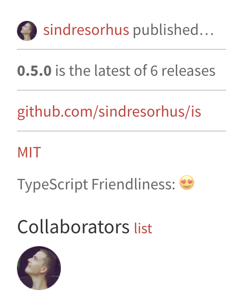

# npm typescript friendliness extension for Chrome and Firefox

As a typescript user, it is really nice to know whether types for a given
package are available.

This chrome extension annotates the npm package pages with a
'typescript friendliness' indicator.

|Indicator|Explanation   |
|---|---|
|😍| Types shipped with the module itself. This means that the types are maintained by the package author(s). This is awesome! |
|😊| 3rd party types available via a `@types/` package. This nice! The types can potentially be out of date though. |
|🤷| No 1st party or 3rd party types available.  |

## Installation

**Chrome:** Install from [chrome web store](https://chrome.google.com/webstore/detail/typescript-friendly/bobgngeadaljeacddbgefcfhhdopmpnc).

**Firefox:** Install add-on: https://addons.mozilla.org/en-US/firefox/addon/typescript-friendly
